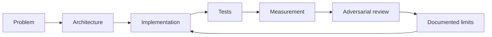

<!--
  Muhammad Sohaib Imran — GitHub profile README
  Repo: https://github.com/sohaib-0897/sohaib-0897
  Snake SVGs are generated by .github/workflows/snake.yml and published to the `output` branch.
-->

<div align="center">


<a href="https://github.com/sohaib-0897?tab=repositories">
  
</a>

<br/>

<a href="https://github.com/sohaib-0897/VigilAi"></a>
<a href="https://github.com/sohaib-0897/OmniOps"></a>
<a href="https://github.com/sohaib-0897/InboxLearn"></a>
<a href="https://github.com/sohaib-0897/DataShield"></a>

</div>

---

## About

Computer Science student and software engineer building **backend systems and applied-AI products** that are testable, inspectable, and honest about their limits.

- **The system around the model** is the part I care about: data flow, persistence, concurrency, evaluation, model lifecycle, and failure states.
- I work across **backend APIs, computer vision, retrieval, agent workflows, and endpoint security** — the connecting thread is systems engineering, not model training.
- I'd rather ship a **measured prototype with documented gaps** than an unverified "production platform".
- Open to **Software Engineering, Backend, Applied AI, ML, and Computer Vision** roles.

```text
problem → architecture → implementation → tests → measurement → adversarial review → documented limits → iterate
```

---

<div align="center">

# Featured Engineering Projects

<sub>Four systems that show how I design, build, verify, and reason about software.</sub>

</div>

<table>
<tr>
<td width="50%" valign="top">

### 👁️ [VigilAI](https://github.com/sohaib-0897/VigilAi)

**Real-time video analytics on CPU-only hardware**

Turns camera streams into persistent object tracks and reviewable events — no GPU required.

- YOLO inference via ONNX Runtime, ByteTrack for identity across frames
- Zone, line-crossing, dwell and occupancy rules evaluated over tracks
- Bounded latest-frame buffering: drops stale frames instead of queueing them
- Event deduplication with annotated snapshots as evidence
- Detection and tracking isolated in a separate CV worker

**Measured (my own benchmark, full pipeline incl. annotation):** 17.3 FPS / 52.2 ms model latency at 1080p · 21.7 FPS / 36.6 ms at 720p — Intel Core i5-13420H, no GPU.

`FastAPI` `YOLO` `ONNX Runtime` `ByteTrack` `OpenCV` `PostgreSQL` `Redis` `Next.js`

</td>
<td width="50%" valign="top">

### 🧩 [OmniOps](https://github.com/sohaib-0897/OmniOps)

**Multimodal evidence & investigation workspace**

An engineering prototype exploring how documents, tables, images and audio become traceable evidence.

- Multimodal ingestion into a single searchable corpus
- Hybrid retrieval: PostgreSQL full-text fused with pgvector dense search
- Evidence provenance and lineage, so answers point back at sources
- Persisted runtime/agent events with authenticated SSE replay
- Constrained execution sandbox for model-invoked tools

**Status:** prototype. Integration and durability issues are open and documented in the repo — read them before assuming it's production-ready.

`FastAPI` `PostgreSQL` `pgvector` `DuckDB` `TypeScript` `Next.js` `Docker`

</td>
</tr>

<tr>
<td width="50%" valign="top">

### 🧠 [InboxLearn](https://github.com/sohaib-0897/InboxLearn)

**Human-in-the-loop email triage**

A self-learning classifier built around *reviewable* learning rather than silent retraining.

- Category and priority classification with a review queue for uncertain predictions
- Revision-aware feedback history from confirmed human corrections
- Immutable candidate model versions, trained but not trusted
- Evaluation gate: a candidate only replaces the active model after passing
- Exact rollback to earlier model behaviour, plus prediction comparison

**Benchmark caveat:** on a *fixed synthetic demo dataset* category accuracy moved 50% → 90% and priority 30% → 80%, with 30 tests in CI. Synthetic data — not a real-world accuracy claim.

`Python` `scikit-learn` `SQLite` `Streamlit` `pytest` `GitHub Actions`

</td>
<td width="50%" valign="top">

### 🛡️ [DataShield](https://github.com/sohaib-0897/DataShield)

**Endpoint DLP & incident response**

A Windows-focused data-loss-prevention prototype wiring endpoint telemetry to an analyst workflow.

- Watchdog filesystem monitoring on the endpoint
- CNIC / national-ID pattern detection (rule-based, not ML)
- Authenticated Flask alert and decision API
- React + Tailwind analyst dashboard with a triage queue
- Allow/block decisions polled by cooperating clients; policy stays server-side
- pytest regression suite running in GitHub Actions

**Scope note:** enforcement depends on cooperating clients — it's a policy loop, not a kernel-level security boundary.

`Python` `Flask` `React` `Tailwind` `Watchdog` `pytest` `GitHub Actions`

</td>
</tr>
</table>

> **How to read the claims above:** every number is from my own benchmark on the hardware named; prototypes are labelled as prototypes; known gaps live in each repo's README rather than being quietly omitted.

---

<div align="center">

# Tech Stack


<br/>


</div>

| Area | Tools I actually use |
|---|---|
| **Languages** | Python · TypeScript / JavaScript · SQL · C/C++ · C# |
| **Backend** | FastAPI · Flask · REST API design · SQLAlchemy · background workers · SSE streaming |
| **Data & Retrieval** | PostgreSQL · SQLite · Redis · pgvector · DuckDB · full-text + vector hybrid search |
| **AI / ML / CV** | scikit-learn · YOLO · ByteTrack · ONNX Runtime · OpenCV · evaluation & model promotion gates |
| **Frontend** | React · Next.js · Tailwind CSS |
| **Infrastructure** | Docker · Git · GitHub Actions · Linux |

---

## How I Build



Data integrity, failure states, persistence, security boundaries and reproducibility matter as much as the model does. The question I hold every project to: **can another engineer inspect the evidence and reach the same conclusion?**

---

<div align="center">

# GitHub Activity


<br/>

<picture>
  <source media="(prefers-color-scheme: dark)" srcset="https://raw.githubusercontent.com/sohaib-0897/sohaib-0897/output/github-contribution-grid-snake-dark.svg" />
  <source media="(prefers-color-scheme: light)" srcset="https://raw.githubusercontent.com/sohaib-0897/sohaib-0897/output/github-contribution-grid-snake.svg" />
  
</picture>

</div>

---

<details>
<summary><b>Other repositories</b></summary>

<br/>

| Repo | What it is |
|---|---|
| [Pepsi-Contract](https://github.com/sohaib-0897/Pepsi-Contract) | Distribution system built on contract: dispatch, sales, returns, inventory and customer balances |
| [Notepad-app](https://github.com/sohaib-0897/Notepad-app) | Small desktop notepad application |
| [FYP](https://github.com/sohaib-0897/FYP) | Final-year project workspace |

</details>

<details>
<summary><b>What I want to work on next</b></summary>

<br/>

| Area | What interests me |
|---|---|
| **Applied AI** | Agent workflows, human-in-the-loop systems, evaluation harnesses, retrieval quality |
| **Computer Vision** | Detection, tracking, real-time analytics, evidence capture on constrained hardware |
| **Backend** | Async systems, job coordination, database design, event flows |
| **Security** | Endpoint monitoring, policy enforcement, sandboxing and trust boundaries |
| **Reliability** | Tests, rollback paths, reproducibility, adversarial validation |

</details>

---

<div align="center">

## Connect

<a href="https://github.com/sohaib-0897">
  
</a>
<!--
  Add LinkedIn when ready — drop this line back in and fill the URL:
  <a href="https://linkedin.com/in/YOUR-HANDLE"></a>

  Add email the same way:
  <a href="mailto:YOUR-EMAIL"></a>
-->

<br/><br/>

### *Build things that can survive inspection.*


</div>
