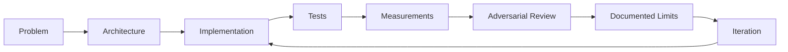

<!--
  Muhammad Sohaib Imran — GitHub Profile README
  Profile repository: https://github.com/sohaib-0897/sohaib-0897
-->

 

---

<table>
<tr>
<td width="58%" valign="top">

## 👨‍💻 About Me

I'm **Muhammad Sohaib Imran**, a Computer Science student and software engineer focused on building **backend systems and applied AI products** that are testable, inspectable, and honest about their limitations.

- 🧠 Building across **AI agents, ML systems, computer vision, security, and backend APIs**
- ⚙️ I enjoy the hard parts around AI: **data flow, persistence, evaluation, model lifecycle, evidence, and reliability**
- 🧪 I prefer **reproducible experiments and tests** over unverified claims
- 🛡️ Interested in systems where **security, automation, and intelligence** meet
- 🌍 Open to **Software Engineering, Backend, Applied AI, ML, and Computer Vision** opportunities
- 🚀 Currently turning portfolio projects into **recruiter-ready, production-minded engineering case studies**

### `build → measure → break → improve → document`

</td>
<td width="42%" align="center" valign="middle">

</td>
</tr>
</table>

---

# 🚀 Featured Engineering Projects

*Four projects that best represent how I design, build, test, and reason about systems.*

<table>
<tr>
<td width="50%" valign="top">

### 🛡️ [DataShield](https://github.com/sohaib-0897/DataShield)
**Endpoint Data Loss Prevention & Incident Response**

A Windows-focused DLP prototype connecting endpoint telemetry to a centralized analyst workflow.

**Highlights**
- Watchdog-based filesystem monitoring
- CNIC-pattern sensitive-data detection
- Authenticated Flask alert/decision API
- React + Tailwind analyst dashboard
- Bidirectional allow/block decision polling
- Pytest + GitHub Actions validation

`Python` `Flask` `React` `Tailwind` `Watchdog` `REST APIs`

</td>
<td width="50%" valign="top">

### 🧠 [InboxLearn](https://github.com/sohaib-0897/InboxLearn)
**Human-in-the-Loop Self-Learning AI Agent**

An email triage system designed around **reviewable learning**, not silent retraining.

**Highlights**
- Category + priority classification
- Human review queue for uncertain predictions
- Revision-aware feedback history
- Immutable candidate model versions
- Evaluation-gated activation
- Exact rollback of earlier model behavior

`Python` `Streamlit` `scikit-learn` `SQLite` `Pytest`

</td>
</tr>

<tr>
<td width="50%" valign="top">

### 👁️ [VigilAI](https://github.com/sohaib-0897/VigilAi)
**Video Analytics & Persistent Object Tracking**

An end-to-end computer-vision platform that turns video streams into reviewable events and evidence.

**Highlights**
- YOLO / ONNX inference pipeline
- ByteTrack object identity across frames
- Zone, line-crossing, dwell & occupancy analytics
- Rule-driven alert lifecycle
- Persistent snapshots and event review
- Separate CV worker with bounded buffering

`FastAPI` `YOLO` `OpenCV` `ByteTrack` `PostgreSQL` `Redis` `Next.js`

</td>
<td width="50%" valign="top">

### 🧩 [OmniOps](https://github.com/sohaib-0897/OmniOps)
**Multimodal Evidence & Investigation Workspace**

An engineering prototype exploring how documents, tables, images, and audio can become traceable business evidence.

**Highlights**
- Multimodal ingestion
- PostgreSQL FTS + pgvector retrieval
- Evidence provenance and lineage
- Persisted agent/runtime events
- Authenticated SSE replay
- Constrained Python sandbox architecture

`FastAPI` `PostgreSQL` `pgvector` `DuckDB` `Next.js` `TypeScript` `Docker`

</td>
</tr>
</table>

---

# 🧰 Tech Arsenal

### Languages

### Backend & Data

### Frontend

### Infrastructure & Engineering

  

---

## 🧬 How I Approach Engineering

I care about the **system around the model** as much as the model itself: data integrity, failure states, persistence, security boundaries, reproducibility, and whether another engineer can actually inspect the evidence.

---

# 📊 GitHub Analytics

---

# 🐍 Watch My Contributions Get Eaten

<picture>
  <source media="(prefers-color-scheme: dark)" srcset="https://raw.githubusercontent.com/sohaib-0897/sohaib-0897/output/github-contribution-grid-snake-dark.svg">
  <source media="(prefers-color-scheme: light)" srcset="https://raw.githubusercontent.com/sohaib-0897/sohaib-0897/output/github-contribution-grid-snake.svg">
  
</picture>

---

<b>⚡ More About What I Build</b>

 

| Area | What interests me |
|---|---|
| 🤖 Applied AI | Agent workflows, human-in-the-loop systems, evaluation, retrieval |
| 👁️ Computer Vision | Detection, tracking, analytics, evidence capture |
| ⚙️ Backend Engineering | APIs, async systems, databases, event flows |
| 🛡️ Security | Endpoint monitoring, policy enforcement, secure system boundaries |
| 📚 Retrieval & Evidence | Hybrid search, provenance, citations, inspectable outputs |
| 🧪 Reliability | Tests, rollback, reproducibility, adversarial validation |

<b>📌 Other Work</b>

 

- 🥤 [Pepsi Contract](https://github.com/sohaib-0897/Pepsi-Contract)
- 🗒️ [Notepad App](https://github.com/sohaib-0897/Notepad-app)
- 🎓 [FYP Repository](https://github.com/sohaib-0897/FYP)

---

## 🤝 Let's Connect

  

### 💭 *Build things that can survive inspection.*

